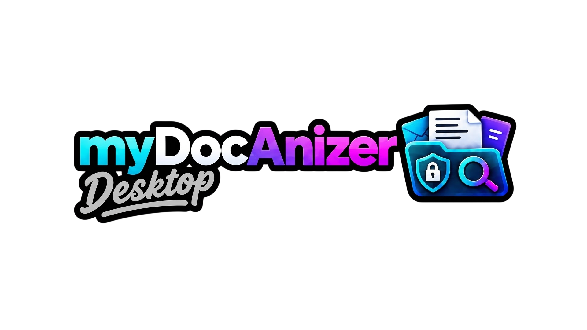
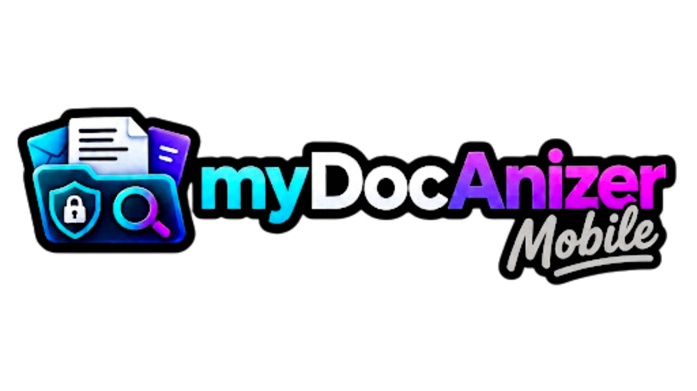

<div align="center">
  <a href="https://github.com/MrLongNight/myDocAnizer_Mobile">
    
  </a>
</div>

Smart Document Scan and Management App for Windows, macOS and Linux.

## Overview

myDocAnizer Desktop is the cross-platform companion to myDocAnizer Mobile. It brings the same privacy-first document workflow to the desktop, allowing users to manage scanned files, organize document collections, synchronize with the mobile app, and work with a larger-screen interface designed for structured document operations.

## Related project

<div align="center">
  <a href="https://github.com/MrLongNight/myDocAnizer_Mobile">
    
  </a>
</div>

myDocAnizer Mobile is the privacy-first Android app for scanning, organizing, and securely managing documents on-device. It is designed for fast capture, local OCR, and encrypted document workflows without sending sensitive content to external services.

## Project links

- Mobile app repository: https://github.com/MrLongNight/myDocAnizer_Mobile
- Desktop companion: https://github.com/MrLongNight/myDocAnizer-Desktop

## Mission & philosophy

- 100% privacy-first document handling with local-first workflows
- Cross-device synchronization with the mobile app
- Secure organization of scanned documents, invoices, and records
- Desktop-first document review experience for larger screens
- No vendor lock-in and no forced cloud dependency

## Key features

- Cross-platform desktop workflow for Windows, macOS, and Linux
- Secure document vault and organization tools
- Pairing and synchronization with myDocAnizer Mobile
- Scanner workflow integration from mobile capture to desktop review
- Export, print, and document management support
- Onboarding and setup flow for fast project adoption
- Modern TypeScript + Vite interface optimized for desktop use

## Architecture

myDocAnizer Desktop is built with TypeScript and Vite, with a modern desktop UI designed around document handling, secure vault workflows, onboarding, exports, and mobile-to-desktop synchronization.

The project focuses on:

- desktop-first document viewing and organization
- pairing and sync with the mobile ecosystem
- secure local workflow management
- export, print, and document review capabilities
- clean user experience for scanning and document processing teams

## Getting started

### Requirements

- Node.js 18+
- npm or bun

### Install dependencies

```bash
npm install
# or
bun install
```

### Run locally

```bash
npm run dev
# or
bun run dev
```

### Build

```bash
npm run build
```

### Lint/type check

```bash
npm run lint
```

## License

The project source code is intended for open-source use under the same ecosystem principles as the mobile app, with branding and design assets protected as project-specific creative assets.

## Related ecosystem

- myDocAnizer Mobile: https://github.com/MrLongNight/myDocAnizer_Mobile
- myDocAnizer Desktop: https://github.com/MrLongNight/myDocAnizer-Desktop
